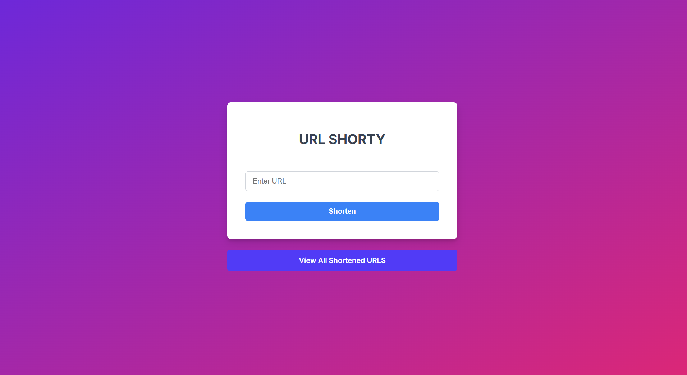
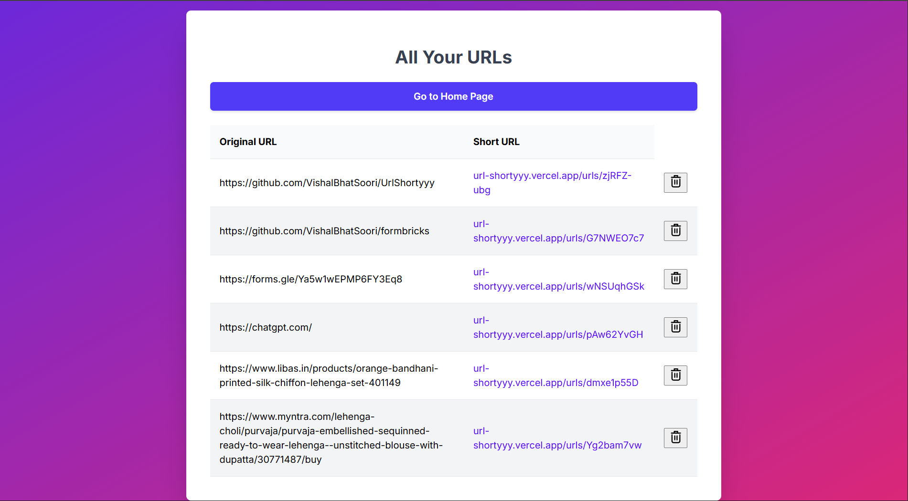
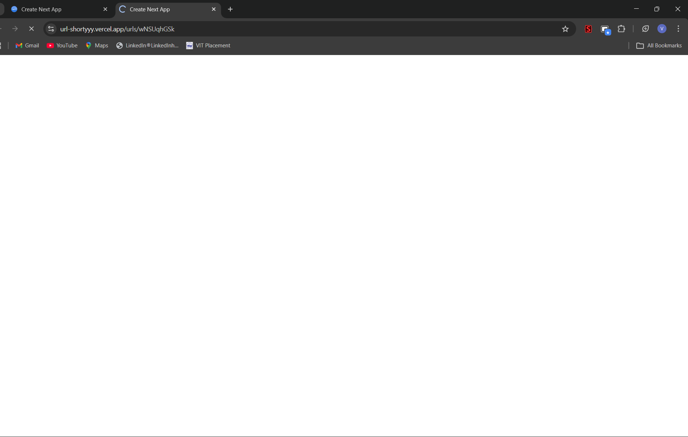
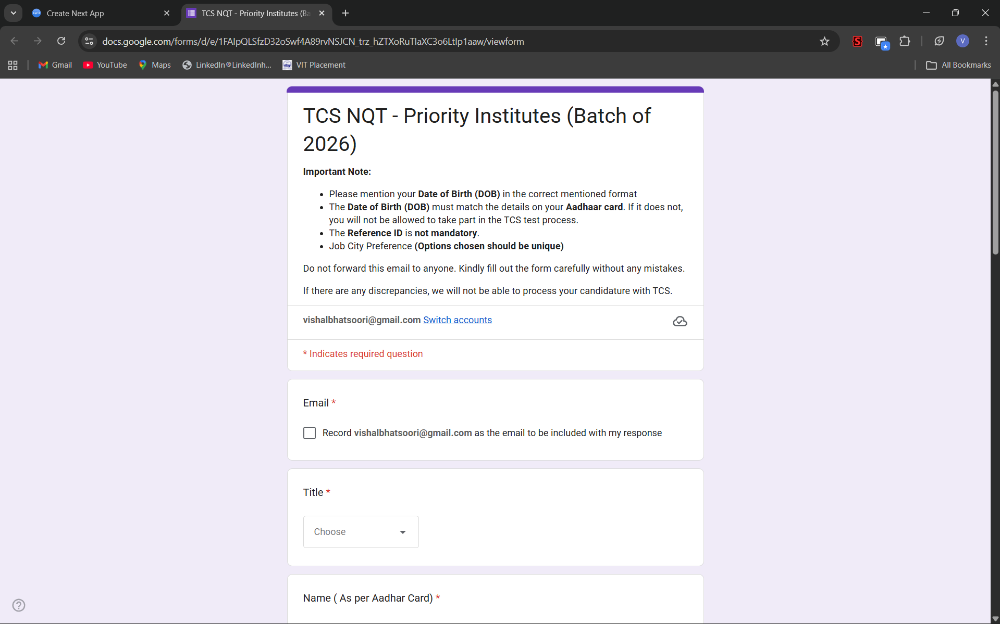
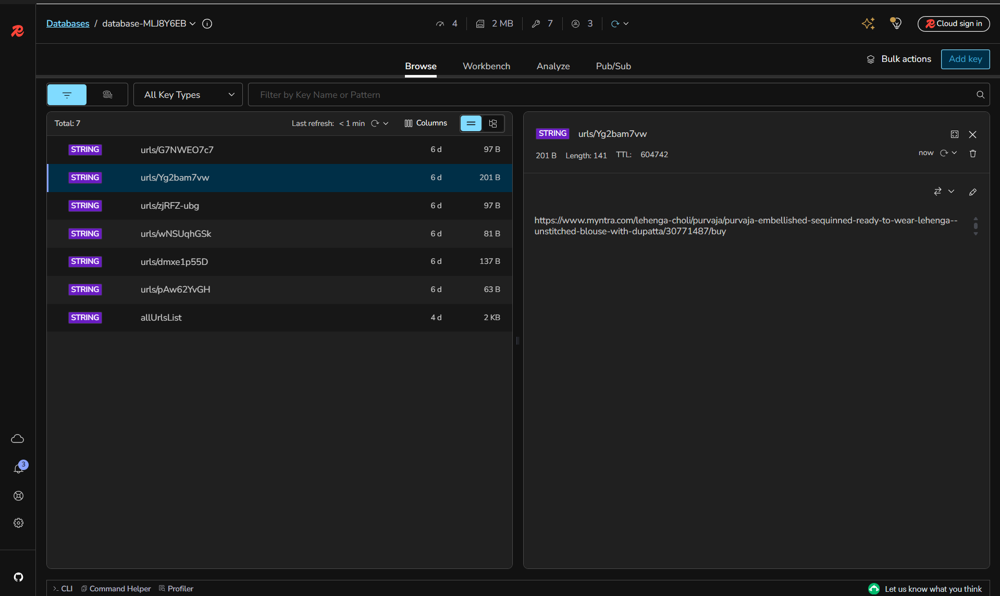
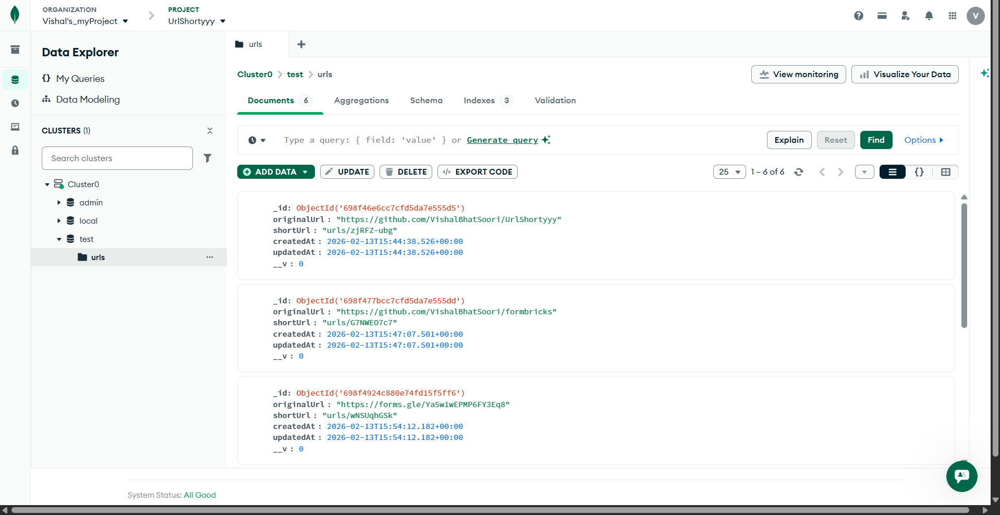
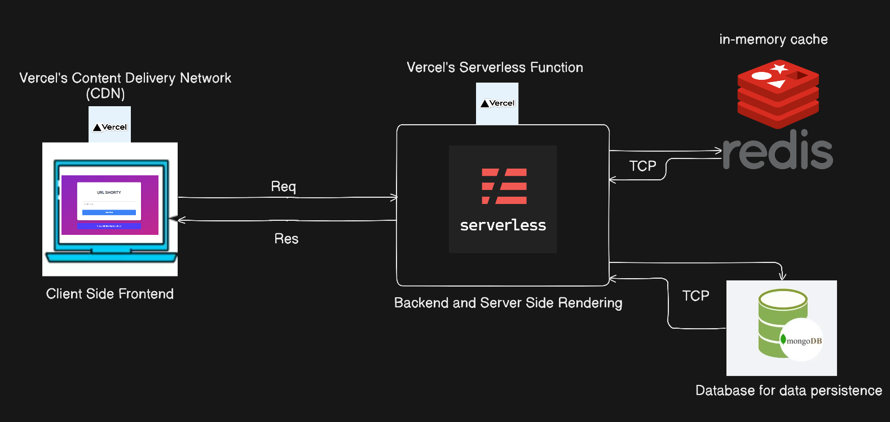

  
  <h1>🔗 UrlShorty</h1>

 

### *A blazing-fast URL shortener built with Next.js (Server Side Rendering), leveraging Redis caching to provide instant redirections and a lightning-fast dashboard experience without constantly hitting the database.*

**Project Motivation:** Built specifically to shorten long Google Form links sent by my college's placement cell and store them in a single, easily accessible dashboard and also for linkedin or insta links sent by friends or the links that I send to myself to watch later in whatsapp.

## Table of Contents
- [🎨 Preview](#preview)
- [🏗 Architecture](#architecture)
- [⚡ How Redis Makes It Blazing Fast](#how-redis-makes-it-blazing-fast)

## 🎨 Preview

### Homepage / Dashboard
*(Shows the interface for generating new short links and viewing existing ones)*

### Redirection Flow
*(Demonstrates the quick lookup and instant redirection to the target URL)*

### Backend Storage & Caching
*(Shows the Redis caching layer and MongoDB Atlas persistent storage)*

## 🏗 Architecture 

The application follows a modern, speed-optimized architecture:
1. **Frontend/Backend (Next.js)**: A full-stack Next.js application that handles UI rendering and API requests.
2. **Primary Data Source (Redis)**: The ultra-fast, in-memory store where all data fetching happens. Because of its incredible read speeds, Redis serves as the primary source for serving data to users.
3. **Persistent Storage & Backup (MongoDB)**: Operates as the permanent storage layer. It safely stores the URL mappings as a backup and is only queried when data expires or is missing from Redis (a cache miss).

## 🛠 Tech Stack

* **Framework:** Next.js (App Router)
* **Language:** TypeScript
* **Database:** MongoDB (Mongoose)
* **Cache:** Redis (ioredis)

## ⚡ How Redis Makes It Blazing Fast

The application relies on **Redis** as the primary source for fetching data, prioritizing its in-memory speed responses and only using MongoDB as a backup storage mechanism.

### 1. Lightning-Fast Single Link Redirection
When a user clicks on a shortened link (e.g., `url-shorty/xyz123`), the system needs to find where that link goes by looking up a string. 

Because **Redis operates entirely in RAM (in-memory)**, the connection overhead is practically zero, and it can retrieve the original URL in less than a millisecond (Hit) to instantly redirect the user. 

If we only used **MongoDB**, the initial load and redirection would be noticeably slower because establishing a connection to a permanent database that reads from a disk carries much heavier network and processing overhead.

*(Note: We only fall back to MongoDB to fetch the mapping if a link is not found in Redis, typically due to expiration. We then instantly populate Redis with it so subsequent reads are lightning fast again.)*

### 2. Instant Dashboard Loading (All Links Page)
When a user visits the dashboard to see all their shortened URLs:
* **The DB Way (MongoDB)**: The server runs a query on MongoDB to fetch every single URL record and return it to the frontend.
* **The Redis Way (Primary)**: 
  - The system fetches the entire pool of URLs (`allUrlsList`) directly from Redis.
  - It instantly parses the JSON data from memory and serves the dashboard to the user without touching the MongoDB database.
  - **Smart Syncing**: When a URL is created or deleted, the application directly updates the list stored in Redis (pushing the new URL or filtering out the deleted one) and updates MongoDB in the background. This ensures that the dashboard always loads instantly from Redis while MongoDB safely keeps the persistent backup.

x

